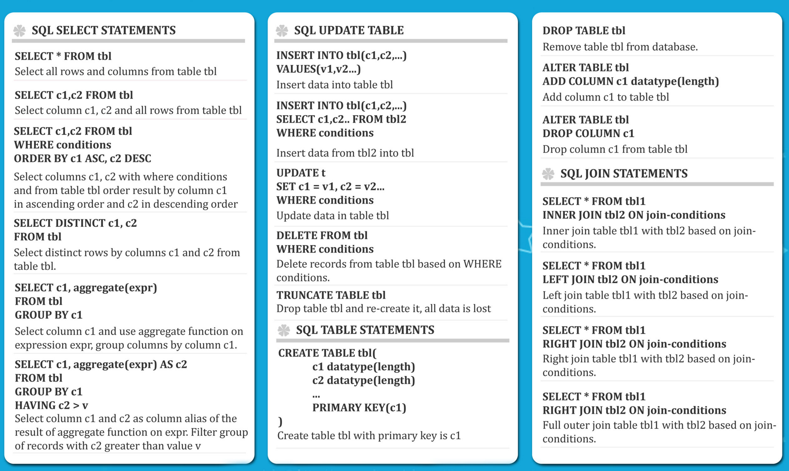
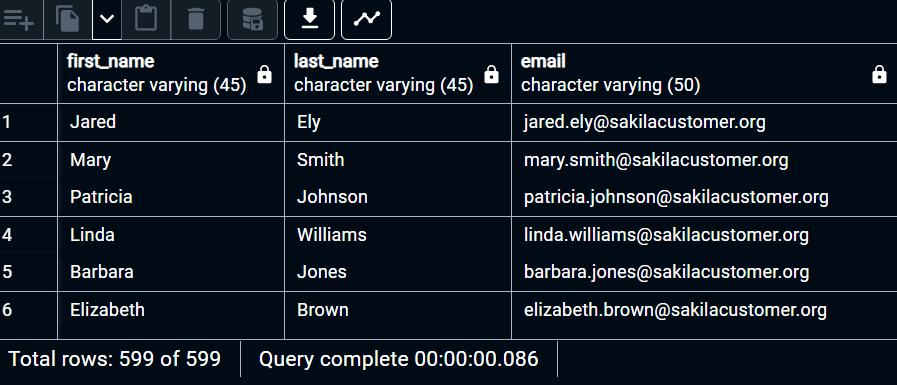
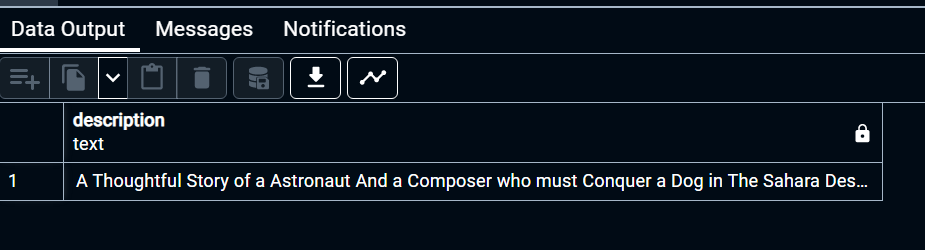

# the complete SQL Bootcamp 2022: Go from Zero to hero

## section 1 : course introduction

---
---

### 4. overview of database

---

spreadsheet versus databases

spreadsheet

- onetime analyse
- quickly neet to chart something out
- reasonable data set size
- ability for untrained people to work with data

databases

- data integrity (secure)
- can handle massive amounts of data
- quickly combine different datasets
- automate steps for re-use
- can support data for websites and applications

databases made up from many tables, and tables made up from columns and rows.

SQL (structured Query Language) is the programming language used to communicate with our database

we will learn how to use SQL

```sql
SELECT customer_id, first_name, Last_name
FROM sales
ORDER BY first_name,
```

## section 2 : SQL Statement Fundamentals

---
---

### 9 Overview of the challanges and cheatsheets

---

challenges
>the basis of these challenge scenarios will be that you've just been hired as a SQL consultant for a DVD Rental Store




### 11. SELECT statement

---

SELECT, allows retrive info, can combine select to select

**SELECT syntax** statement

```sql
SELECT column_name FROM table_name
```

**==capitalize sql and semicolon== syntax it's not necesarry**, it will still run, **but it much easier** to read the different between syntax statement and the name of table and columns that you give in

==database >>> tables >>> column + rows(data)==

```sql
SELECT c1 FROM table_1
SELECT c1,c2 FROM table_1
SELECT c1,c3 FROM table_1
SELECT * FROM table_1
```

in gerneral it is **not** **good practice to use and asterisk (*)** in the SELECT, it will query everything, which **increases traffic between database server and the application**, which can **slow down** the retrieval of results.

how to see **==tables== in pgadmin** is go to **database that you choose >> schema >> public >> tables**

how to see **==columns== in pgadmin** is go to **database that you choose >> schema >> public >> tables >> columns**

### 13. challange: SELECT

---

challange structures

- business situation (importants)
- challenge question
- expected answer
- hints
- solution

==situation==
==we want to send out a promotional email to our existing customers!==

==answer==

```sql
SELECT first_name,last_name,email FROM customer;
```



### 14. SELECT DISTINCT

---

when you want to **list the unique / distinct values** in the collumn

the **DISTINCT** keyword can be used to return only the **distinct values in a column**

the **DISTINCT** keyword operates on a column (**inside a column**)

```sql
SELECT DISTINCT column_name FROM table_name
SELECT DISTINCT (column_name) FROM table_name
```

it will work with or without **parenthesis**


### 15. challange: SELECT DISTINCT

---

==situation==

- ==An aurtralian visitor isn't familiar with mpaa movie ratings(pg, pg-13,r,etc)==
- ==we want to know the types of ratings we have in our database.==
- ==what ratings do we have available?==

==answer==

```sql
SELECT DISTINCT rating FROM film;
```


### 16. COUNT

---

the **COUNT** function **returns the number of input rows** that match a specific condition of a **query**.

we can apply **COUNT** on aspecific column or jsut pass **COUNT(*)**, we will soon see this should return the **same result**.

==the **COUNT** need a parenthesis cuz it's a function acting on something==


```sql
SELECT COUNT(name) FROM table;
SELECT COUNT(choice) FROM table;
SELECT COUNT(*) FROM table;
```

all will return the same thing, since the original table have 4 rows


that's why we usually see `SELECT COUNT(*) FROM table;`

we can combined the DISTINCT and COUNT

```sql
SELECT COUNT(DISTINCT column_name) FROM table_name;
```

for example

```sql
SELECT COUNT(DISTINCT amount) FROM payment
```


### 17. SELECT WHERE - part one

---

**SELECT** and **WHERE** is the most fundamental SQL statements

the **WHERE** statement allows us to **specify conditions on columns** for the rows to be returned.

basic syntax example

```sql
SELECT column1, column2
FROM table_name
WHERE conditions;
```

==conditions==

- the **conditions** are used to filter the rows returned from the **SELECT** statement.
- postgreSQL provides a variety of standard operators to construct the **conditions**


### 18. SELECT WHERE - part two

---

```sql
SELECT * FROM customer WHERE first_name= 'Mary';
```


```sql
SELECT * 
FROM film 
WHERE rental_rate > 4 AND replacement_cost >= 19.99 AND rating = 'R';
```


```sql
SELECT COUNT(title) 
FROM film 
WHERE rating = 'R' OR rating = 'PG-13';
```

you can use **COUNT(title) or COUNT(*)** because it's the same


```sql
SELECT rating 
FROM film 
WHERE rating != 'R';
```


### 19. challange: SELECT WHERE

---

==situation 1==

- ==A customer forgot their wallet at our store! we need to track down their email to inform them.==
- ==what is the email for the customer with the name nancy thomas?==

==answer==

```sql
SELECT email 
FROM customer 
WHERE first_name = 'Nancy' AND last_name = 'Thomas';
```


==situation 2==

- ==A customer wants to know what the movie "Outlay Hanky" is about.==
- ==Could you give them the description for the movie "Outlaw Hanky"?==

==answer==

```sql
SELECT description 
FROM film 
WHERE title = 'Outlaw Hanky';
```



it will **check the capiltalization matching up**

==situation 3==

- ==A customer is late on their movie return, and we've mailed them a letter to their address at '259 Ipoh Drive'. we should also call them on the ophone to let them know.==
- ==can you get the phone number for the customer who lives at '259 Ipoh Drive'?==

==answer==

```sql
SELECT phone
FROM address
WHERE address = '259 Ipoh Drive';
```


### 20. ORDER BY

---

you may have noticed opstgreSQL sometimes returns the same request query results in a different order.

you can use **ORDER BY** to **sort rows based on a column value, in either ascending or descending order.**

we want to do any selection and **filtering first, before finally sorting**. that's why **ORDER BY** is in the end

if we have the **WHERE** statement it will go before the **ORDER BY**

the syntax was

```sql
SELECT column_1,column_2
FORM table
ORDER BY column_1 ASC/DESC
```

Use **ASC** or **DESC** or if you leave it blank, **ORDER BY** uses **ASC** by **default**


==the **sorting will short company first and then the sales**==


```sql
SELECT store_id,first_name,last_name
FROM customer
ORDER BY store_id DESC,first_name ASC
```


you can use **ORDER BY without including the sorting id into the SELECT**

```sql
SELECT first_name,last_name
FROM customer
ORDER BY store_id DESC,first_name ASC
```


### 21. LIMIT

---

the **LIMIT** command allows us to limit the number of rows returned for a query.

useful for not wanting to return every single row in a tale, but only view the top few rows to get an idea of the table layout.

**LIMIT** also becomes useful in combination with **ORDER BY**

**LIMIT** goes at **the very end of a query request** and **is the last command to be eecuted**.

basic syntax of **LIMIT**

for example **if you have want 5 most recent purchase**

```sql
SELECT * FROM payment
ORDER BY payment_date DESC
LIMIT 5;
```


```sql
SELECT * 
FROM payment
WHERE amount != 0.00
ORDER BY payment_date DESC
LIMIT 5;
```


some people used to run this code to **quickly show what datatype there are and what example the value is, to see the general layout of a table**

```sql
SELECT * 
FROM payment
LIMIT 1;
```

### 22. challenge: ORDER BY

---

==situation 1==

- ==We want to reward our first 10 paying customers.==
- ==What are the customer ids of the first 10 customers who created a payment?==

==answer==

```sql
SELECT customer_id
FROM payment
WHERE amount >= 0.00
ORDER BY payment_date ASC
LIMIT 10
```


==situation 2==

- ==A customer wants to quickly rent a video to watch over their short lunch break.==
- ==What are the tiles of the 5 shortest (in length of runtime) movies?==

==answer==

```sql
SELECT title,length
FROM film
ORDER BY length ASC
LIMIT 5
```

the **length** is light up because the **length** is sequel keyword. **try best to not match up column name and sequel keyword**. it will still work because **length** is a column name


==situation 3==

- ==if the previous customer can watch any movie that is 50 minutes or less in run time, how many options does she have?==

==answer==

```sql
SELECT COUNT(*)
FROM film
WHERE length <= 50
```


### 23. BETWEEN

---

**BETWEEN** operator can be used to match a value against a range of values:

- value **BETWEEN** low **AND** high (==inclusive==)
  - it's the same as **value >= low AND value <= high**
- value **NOT BETWEEN** low **AND** high (==exclusive==)
  - it's the same as **value < low OR value > high**

the **BETWEEN** operator can also be used with **dates**. Note that you need to **format** **dates** in the **ISO 8601** standard format, which is **YYYY-MM-DD**

- **date BETWEEN '2007-01-01' AND '2007-02-01'**

the syntax is

```sql
SELECT * 
FROM payment
WHERE amount NOT BETWEEN 8 AND 9;
```


the syntax with the **date**

```sql
SELECT * 
FROM payment
WHERE payment_date BETWEEN '2007-02-01' AND '2007-02-15'
```


### 24. IN

---

instead of writing a bunch of **OR** statement such as `name : 'david' OR name : 'clare' OR name : 'zack'` you can use ==**WHERE** name **IN** ('david','clare', 'zack')==

the syntax is

```sql
WHERE color NOT IN ('red','blue')
```

THE EXAMPLE

```sql
SELECT * 
FROM payment
WHERE amount IN (0.99,1.98,1.99)
```


### 25. LIKE and ILIKE

---

using pattern matching

what if we want to match against a general pattern in a string?

- all emails ending in '@gmail.com'
- all names that begin with an 'A'

the **LIKE** operator allows us to perform **pattern matching agains string data** with the use of **wildcard characters**:

- percent **%**
  - matches any sequence of characters
- underscore **_**
  - matches any single character

==percent==

- all names that begin with an 'A'
  - **WHERE** name **LIKE** 'A%'
- all names that end with an 'a'
  - **WHERE** name **LIKE** '%a'

**LIKE** is **case-sensitive**, we can use **ILIKE** which is **case-insensitive**

==underscore==

- using the **underscore** allows us to **replace just a single character**
  - get all Mission Impossible films
  - **WHERE** title **LIKE** 'Misiion impossible **_**'

- you can use **multiple underscores** like ('version#A4', 'version#B7', etc)
  - **WHERE** value **LIKE** 'Version#__'

we can also **combine pattern matching operator** to create more complex patterns.

- **WHERE** name **LIKE** '_her%'
  - Cheryl
  - Theresa
  - Sherri

>==keep in mind postgreSQL does support full regex capabilities==
<https://www.postgresql.org/docs/current/functions-matching.html>

```sql
SELECT * FROM customer 
WHERE first_name ILIKE 'j%' AND last_name LIKE 'S%'
```

```sql
SELECT * FROM customer 
WHERE first_name LIKE '%er%'
```

it's searching someone named er in any state, could beginning, middle, or the end.

```sql
SELECT * FROM customer 
WHERE first_name LIKE '_her%'
```

it's searching for second character start with her something

```sql
SELECT * FROM customer 
WHERE first_name NOT LIKE '_her%'
```

it's searching for someone who second char not start with her

```sql
SELECT * FROM customer 
WHERE first_name LIKE 'A%' AND last_name NOT LIKE 'B%'
```

it's searching for someone start with a but not b in the last name

### 26. GENERAL CHALLANGE

---

==situation 1==

- ==How many payment transactions were greater than $5.00==

==answer==

```sql
SELECT COUNT(*) 
FROM payment
WHERE amount >= 5.00;
```


==situation 2==

- ==How many actors have a first name that starts with the letter P?==

==answer==

```sql
SELECT COUNT(*) 
FROM actor
WHERE first_name LIKE 'P%';
```


==situation 3==

- ==How many unique districts are our customers from?==

==answer==

```sql
SELECT COUNT(DISTINCT district) 
FROM address
```


==situation 4==

- ==retrieve the list of names for those distinct districts from the previous question==

==answer==

```sql
SELECT DISTINCT district
FROM address
```


==situation 5==

- ==how many films have a rating of R and a replacement cost between $5 and 15?==

==answer==

```sql
SELECT COUNT(*)
FROM film
WHERE rating = 'R' AND replacement_cost BETWEEN 5 AND 15
```


==situation 6==

- ==how many films have the word truman somewehere in the title==

==answer==

```sql
SELECT COUNT(*)
FROM film
WHERE title LIKE '%Truman%'
```


## section 3 : GROUP BY statement

---
---

### 28. Aggregation function

---


aggregation function calls happern only in the **SELECT** clause or the **HAVING** clause.

AVG() returns a floating point value.
ROUND() to specify precision after the decimal.
COUNT() SIMPLY RETURN THE NUMBER OF ROWS

```sql
SELECT MIN(replacement_cost)
FROM film
```


```sql
SELECT MAX(replacement_cost)
FROM film
```


it will return the minimal value OR maximal value of replacement cost

```sql
SELECT MAX(replacement_cost),MIN(replacement_cost),COUNT(*) 
FROM film;
```


it **can be combine because they returning a singular value**

```sql
SELECT ROUND(AVG(replacement_cost),3)
FROM film;
```


```sql
SELECT SUM(replacement_cost)
FROM film;
```


### 29. GROUP BY - part one 

---